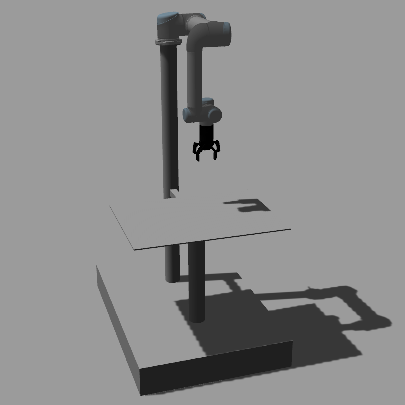
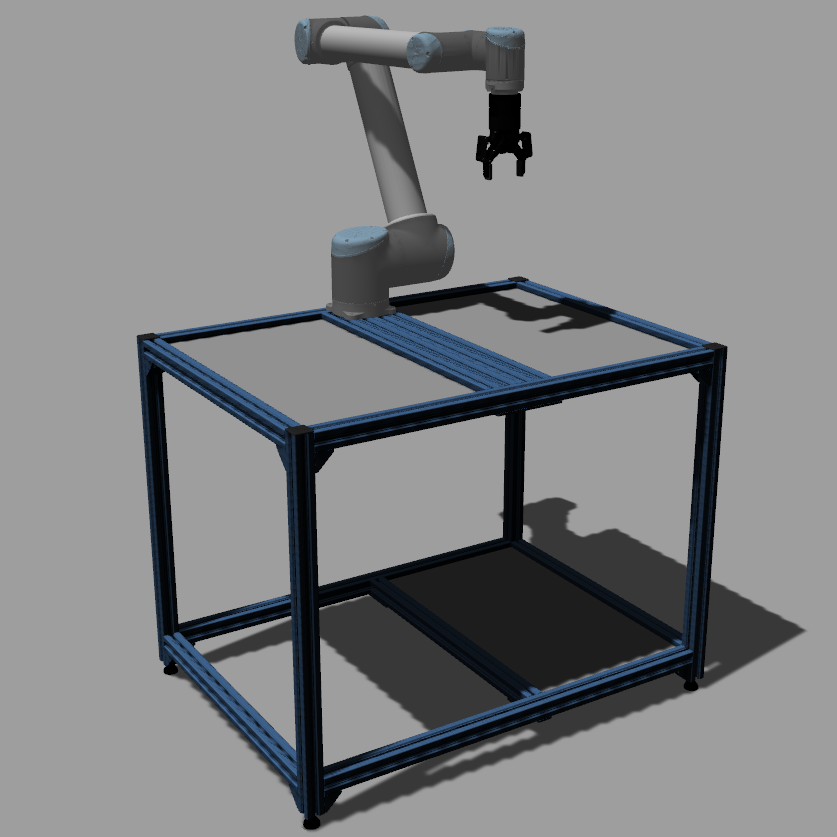

# coro_workstations

## Overview

This ROS package is meant as an easy way to use some of the robotics workstation available at the CoRo lab (ÉTS, Montréal). The idea is to create simple launch files that allows the user to either work in simulation or connect directly to the workstations and be able to run (almost) the same code in both cases.

The following workstations are available within this package:

| UR5 Workstation | UR10 Workstation | UR5e Workstation |
| --- | --- | --- |
|  |  |  |

### License

The source code is released under a [BSD 3-Clause license](coro_workstations/LICENSE).

**Author: Alexandre Bernier 
Affiliation: [CoRo, ÉTS](http://en.etsmtl.ca/unites-de-recherche/coro/accueil?lang=en-CA) 
Maintainer: Alexandre Bernier, ab.alexandre.bernier@gmail.com**

The coro_workstations package has been tested under ROS Noetic on Ubuntu 20.04.

## Installation

### Building from Source

#### Dependencies

The following packages can be installed as Debian packages. See links for installation instructions:

- [ROS Noetic](http://wiki.ros.org/noetic/Installation/Ubuntu) (Ubuntu 20.04 is required)
- [MoveIt](https://moveit.ros.org/install/)

You will need to clone and build from source the following packages before trying to build coro_workstations (pay attention to the versions/branches indicated for each package):

- [fmauch/universal_robot](https://github.com/fmauch/universal_robot.git) (calibration-devel branch)
- [alexandre-bernier/ur_modern_driver](https://github.com/alexandre-bernier/ur_modern_driver.git) (noetic-devel branch)
- [ros-industrial/robotiq](https://github.com/ros-industrial/robotiq.git) (kinetic-devel branch)
- [ros-industrial/ur_msgs](https://github.com/ros-industrial/ur_msgs.git) (melodic branch)
- [UniversalRobots/Universal_Robots_ROS_Driver](https://github.com/UniversalRobots/Universal_Robots_ROS_Driver.git) (master branch)

**If you're building ros-industrial/robotiq on ROS Noetic, catkin will generate errors with packages related to the Robotiq 3f gripper. Since we don't need that gripper, I suggest you simply delete every packages/directories related to the 3f gripper before building.**

#### Building

To build from source, clone the latest version from this repository into your catkin workspace and compile the package using

	cd catkin_ws/src
	git clone https://github.com/alexandre-bernier/coro_workstations.git
	cd ../
	rosdep install --from-paths . --ignore-src
	catkin_make

## Usage

Run a simulated workstation with:

	roslaunch coro_workstations ur5_workstation.launch

Or connect to the hardware workstation with:
	
	roslaunch coro_workstations ur5_workstation.launch robot_ip:=<robot's ip address>
	
Before launching a hardware workstation, make sure to be connected to the wired `CoRo-Network` (not WiFi as there's a significant delay with wireless).
	
**Before launching the hardware UR5e workstation, you need to follow these steps:**

1. On the Teach Pendant, uninstall `Robotiq_Grippers` and `Force_Copilot` URCaps. Make sure that the `rs485` and `External Control` URCaps are still installed.
2. Load the program `ROS.urp`. Make sure that the `ROS` installation is also loaded. It should load automatically with the `ROS.urp` program.
3. Click on `Installation` > `URCaps` > `External Control` and enter **your PC**'s IP address in the `Host IP` field. It should have the following format: `192.168.1.###`.
4. Launch the hardware workstation in ROS using the command line above. Make sure to set the `robot_ip` argument with the **robot**'s IP address (not your PC).
5. Once you see the green line **`You can start planning now!`** in the terminal, start the robot's program on the Teach Pendant.
6. Wait 5 seconds and **stop** (not pause) the robot's program you just launched on the Teach Pendant and **restart** it. That may seem a weird thing to do, but this workaround is the only way to get the gripper to work through TCP/IP (which is how it's setup on the UR5e workstation).
7. Wait 5-10 seconds and open a new terminal and launch the following: **`roslaunch coro_workstations launch_gripper.launch`**. You may need to try and launch this a few times before it works. If it doesn't work at all, stop the Teach Pendant program and the **`launch_gripper.launch`** process and go back to step **5**.

Once you're done working with the UR5e workstation, try to remember to reinstall the `Robotiq_Grippers` and `Force_Copilot` URCaps. You should be able to find the installation files for all the URCaps on a USB stick plugged into the robot's controller.
	
## URDF setup

All workstations have been built using URDF files. All of which can be found in coro_workstation/coro_descriptions/urdf/workstations.

**ur5_workstation.urdf.xacro includes:**

- Universal Robot UR5 CB2
- Robotiq 2F-85 gripper
- Robotiq FT300 force-torque sensor
- 3 arms metal table (coro_workstations/coro_descriptions/urdf/common/coro_3arms_table.urdf.xacro)

**ur10_workstation.urdf.xacro includes:**

- Universal Robot UR10 CB2
- Robotiq 2F-85 gripper
- Robotiq FT300 force-torque sensor
- Large vention table (coro_workstations/coro_descriptions/urdf/common/coro_large_vention_table.urdf.xacro)
	
**ur5e_workstation.urdf.xacro includes:**

- Universal Robot UR5 eSeries
- Robotiq 2F-85 gripper
- Robotiq FT300 force-torque sensor (embbeded within the UR5e)
- Small vention table (coro_workstations/coro_descriptions/urdf/common/coro_small_vention_table.urdf.xacro)

## Launch files (coro_workstations/coro_workstations/launch)

* **ur5_workstation.launch:** runs all node required to interact with either the simulated or hardware workstation.

	Simulated workstation
	
	- **`robot_ip`** If this argument isn't provided, the workstation will launch in simulation. Default: `no_ip`.

	Hardware workstation
	
	- **`robot_ip`** By provinding an IP address, the launch file will try to connect to the hardware and Gazebo won't be started. Default: `no_ip`.
	- **`gripper_comport`** Complete path to the Gripper USB device. Default: `/dev/ttyUSB0`.
	- **`ft_comport`** ID of the force-torque sensor USB device (complete path without `/dev/`). Default: `ttyUSB1`.

* **ur10_workstation.launch:**

	Simulated workstation
	
	- **`robot_ip`** If this argument isn't provided, the workstation will launch in simulation. Default: `no_ip`.

	Hardware workstation
	
	- **`robot_ip`** By provinding an IP address, the launch file will try to connect to the hardware and Gazebo won't be started. Default: `no_ip`.
	- **`gripper_comport`** Complete path to the Gripper USB device. Default: `/dev/ttyUSB0`.
	- **`ft_comport`** ID of the force-torque sensor USB device (complete path without `/dev/`). Default: `ttyUSB1`.

* **ur5e_workstation.launch:**

	Simulated workstation
	
	- **`robot_ip`** If this argument isn't provided, the workstation will launch in simulation. Default: `no_ip`.

	Hardware workstation
	
	- **`robot_ip`** By provinding an IP address, the launch file will try to connect to the hardware and Gazebo won't be started. Default: `no_ip`.

* **launch_gripper.launch:**

	This file is only required if you're using the UR5e workstation as we need to launch the gripper's driver asynchronously. In that case, you should launch this default arguments.
	
	- **`num_grippers`** You can have 1 or 2 grippers connected. Default: `1`.
	- **`comport`** The path to the gripper's device file. Default: `/tmp/ttyUR`.
	- **`baudrate`** The baudrate of the gripper. Default: `115200`.

## Nodes (coro_workstations/coro_workstations/nodes)

You can use the source code of these nodes as a starting point to interact with the workstations. The only differences between the simulated and hardware workstations is the way to interact with the Robotiq 2f-85 gripper (no MoveIt support with the hardware version) and the absence of simulated data from the Robotiq FT300 force-torque sensor.

**Before running any of these nodes with hardware workstations, make sure the robot is free to move a few centimeters from its current position in all directions.**

### test_sim_workstation

Makes sure the simulated workstation runs properly. This node:

- makes the robot move a few centimeter from its current position in all axis using MoveIt;
- closes and opens the gripper using MoveIt.

### test_hw_workstation

Makes sure the hardware workstation runs properly. This node:

- makes the robot move a few centimeter from its current position in all axis using MoveIt;
- closes and opens the gripper using ROS topics;
- subcribes to the force-torque sensor ROS topics (look out for the differences between CB2 vs CB3/eSeries).

**Keep an eye on the robot during this script as the inverse kinematic may sometimes generate a trajectory that changes the robot's configuration in a way where it needs to flip itself to reach its destination.**

## Bugs & Feature Requests

Please report bugs and request features using the [Issue Tracker](https://github.com/alexandre-bernier/coro_workstations/issues).

